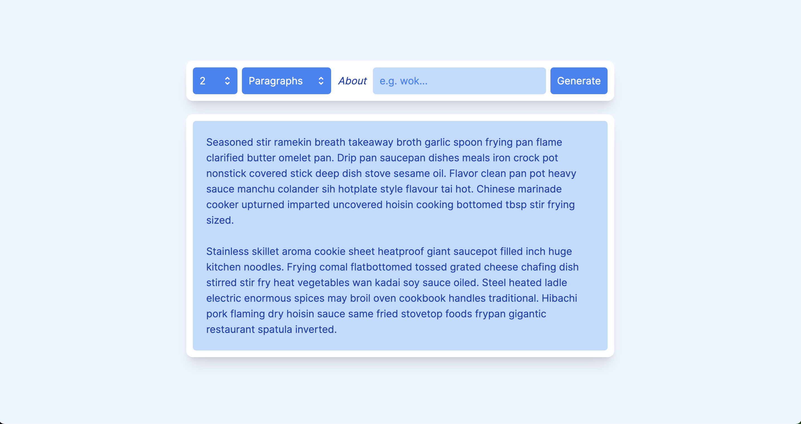

# Lorem Ipsum Totalis

Generate themed placeholder text from any word or phrase.



## Features

- Turborepo
- Typescript
- Vite
- Vue 3
- Tailwind CSS
- Eslint
- Prettier
- Lint-staged
- Emoji conventional commits

## Installation

```bash
yarn install
```

## Development

```bash
yarn dev
```

To commit changes use the commit helper script to build a valid conventional commit

```bash
yarn commit
```

## Contributing

Pull requests are welcome. For major changes, please open an issue first to discuss what you would like to change.

Please make sure to update tests as appropriate.

## License

[MIT](https://choosealicense.com/licenses/mit/)
